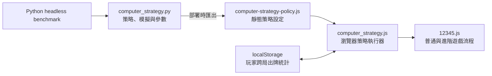

# 電腦出牌策略更新說明

## 更新摘要

本次更新將原本「預先隨機洗牌、隨機選擇功能卡」的電腦出牌方式，改為可調整強度的規則式隨機策略。

這不是機器學習或生成式 AI，也不需要執行中的 Python 後端。Python 負責定義策略參數、模擬對局、校準勝率及產生靜態策略設定；正式遊戲仍可完整部署在 GitHub Pages。

策略同時涵蓋：

- 普通模式的 1～5 數字牌選擇。
- 進階模式的數字牌選擇。
- 進階模式的 J、Q、K、JOKER 與放置位置選擇。
- 初階、中階、高階三種電腦強度。
- 僅保存在使用者瀏覽器內的跨局出牌習慣統計。

## 核心架構



正式遊玩時沒有 API 請求：

1. GitHub Actions 執行 Python 測試與無畫面模擬。
2. Python 產生靜態策略設定檔。
3. GitHub Pages 發布 `frontend`。
4. 瀏覽器載入策略設定並在本機完成決策。

## 出牌演算法

### 數字牌

每回合會評估所有尚未使用的電腦牌：

```text
候選分數 = Σ 玩家可能出牌機率 × 後續盤面效用
最終分數 = 候選分數 / 固定效用尺度 + Normal(0, 難度雜訊)
```

玩家可能出牌機率由以下資訊組成：

- 玩家目前剩餘的合法牌。
- 該回合位置過去曾出現各數字的次數。
- Laplace 平滑，避免少量資料造成極端判斷。
- 樣本信心值；未累積足夠完整對局前，歷史資料只占很低權重。

常態分布作用在「候選牌評分」，而不是直接對數字 1～5 抽樣，因此能正確處理 1 勝 5、2 勝 4 的特殊規則。

### 進階功能卡

電腦會列舉所有仍可使用的「功能卡 × 位置」組合，並針對玩家所有合法組合模擬：

1. J／Q 左右交換。
2. K 同位置交換。
3. JOKER 全盤交換。
4. 計算大局勝負、小分差、是否能結束比賽，以及保留功能卡的價值。
5. 依難度混合期望分數、最差情況、隨機率與常態雜訊。

### 公平性

- 電腦數字牌會在玩家選擇當回合牌之前決定並暫存。
- 電腦功能卡會在玩家開啟功能卡選擇視窗前決定並暫存。
- 決策輸入不包含玩家當回合尚未揭露的選擇。
- 未完成便重新開始的對局不會寫入觀察紀錄。

## 難度設計

| 難度 | 數字牌策略 | 功能卡策略 | 跨局統計 |
|---|---|---|---|
| 初階 | 高隨機、高雜訊、可能選擇低分牌 | 含刻意失誤機率 | 不使用 |
| 中階 | 推演目前及後續兩回合 | 多數保持隨機，開始考慮盤面與保留卡 | 低至中權重 |
| 高階 | 推演至該大局結束 | 加入最差情況與保留卡價值 | 受樣本信心限制的較高權重 |

即使是高階仍保留隨機率，因此不會形成完全固定的出牌套路。

## 跨局觀察資料

觀察資料使用版本化 `localStorage`，分開保存普通與進階模式：

- 五個回合位置各數字的出牌次數。
- 進階功能卡使用次數。
- 功能卡放置位置次數。
- 完成的普通局／進階大局數量。

舊資料每次更新會乘以 `0.98`，讓近期習慣的影響略高於很久以前的紀錄。資料不會離開瀏覽器，玩家可在戰績面板按「清除觀察紀錄」。

## Python 無畫面模擬

演算法勝率不以 UI 人機操作判斷。正式 benchmark 完全由 Python 模擬普通／進階規則及雙方決策：

```powershell
python backend/computer_strategy.py --simulate 10000 --benchmark suite --seed 12345 --report strategy-report.json
```

`suite` 包含四類情境：

- 普通模式／隨機對手。
- 普通模式／固定出牌習慣對手。
- 進階模式／隨機對手。
- 進階模式／固定出牌與功能卡習慣對手。

本次以每個情境 1,000 場、共 12,000 場取得的校準結果：

| 情境 | 初階 | 中階 | 高階 |
|---|---:|---:|---:|
| 普通／隨機對手 | 35.9% | 35.4% | 37.0% |
| 普通／固定習慣 | 37.7% | 51.1% | 64.4% |
| 進階／隨機對手 | 50.4% | 52.3% | 60.2% |
| 進階／固定習慣 | 45.9% | 54.6% | 65.0% |

普通模式面對真正隨機對手時，各難度仍接近遊戲原始機率；難度差距主要出現在可推演的進階盤面，以及玩家具有可觀察習慣時。

## 靜態策略產生

重新產生前端使用的策略設定：

```powershell
python backend/computer_strategy.py --export frontend/assets/generated
```

輸出檔為 `frontend/assets/generated/computer-strategy-policy.js`。該檔案是產生物，不應手動修改；難度參數應修改 `backend/computer_strategy.py` 後重新匯出。

## 測試與驗證

### Python 測試

```powershell
python -m unittest discover -s tests -p "test_*.py" -v
```

涵蓋：

- 特殊數字牌勝負規則。
- 固定亂數種子的可重現性。
- 所有難度只會選擇合法剩餘牌。
- 功能卡效果順序與合法選擇。
- 歷史統計需完成對局後才生效。
- 普通與進階難度勝率依序提升且不超出設定上限。
- benchmark suite 同時涵蓋兩種模式及兩類對手。

### 瀏覽器執行器測試

```powershell
node tests/test_computer_strategy_runtime.js
```

UI 僅驗證策略是否正確接進遊戲流程、跨局紀錄是否更新、難度控制是否可用，以及桌面／手機版是否正常；不以 UI 操作結果判斷演算法勝率。

## 本次變更檔案

### 新增

| 檔案 | 用途 |
|---|---|
| `backend/computer_strategy.py` | Python 策略核心、無畫面模擬、難度參數與靜態策略匯出 |
| `frontend/computer_strategy.js` | GitHub Pages 瀏覽器策略執行器及本機觀察資料管理 |
| `frontend/assets/generated/computer-strategy-policy.js` | Python 產生的靜態策略設定 |
| `tests/test_computer_strategy.py` | Python 規則、策略、難度與 benchmark 測試 |
| `tests/test_computer_strategy_runtime.js` | 瀏覽器策略執行器測試 |
| `STRATEGY_UPDATE.md` | 本次更新說明 |

### 修改

| 檔案 | 變更內容 |
|---|---|
| `frontend/12345.js` | 普通／進階模式改接策略、預先鎖定電腦行動、寫入完整對局觀察資料 |
| `frontend/index.html` | 新增三段難度控制、觀察狀態與清除按鈕，載入策略檔 |
| `frontend/12345.css` | 難度控制及觀察紀錄區的桌面／手機樣式 |
| `.github/workflows/deploy-pages.yml` | 部署前執行 Python 測試、headless benchmark、策略匯出及 JavaScript 執行器測試 |
| `README.md` | 補充策略架構、純靜態部署、模擬與匯出指令 |

## 執行時是否需要後端

不需要。

現有 Flask `/game_result` 沒有參與這次策略流程。Python 只在開發、測試及 GitHub Actions 部署階段執行；玩家開啟正式網站後，所有決策與跨局統計都在瀏覽器本機完成。
